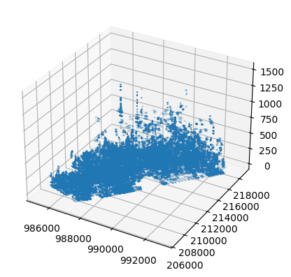
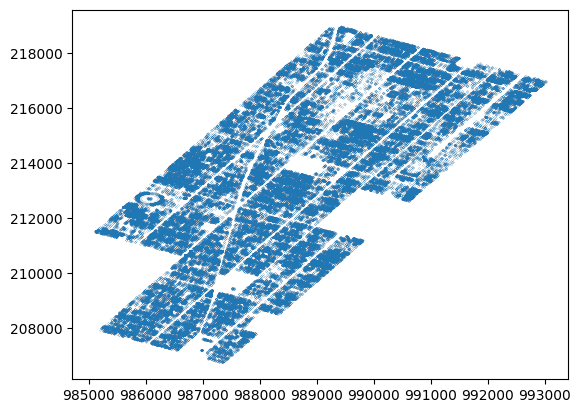
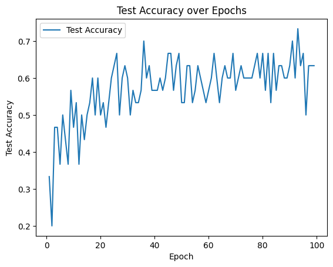
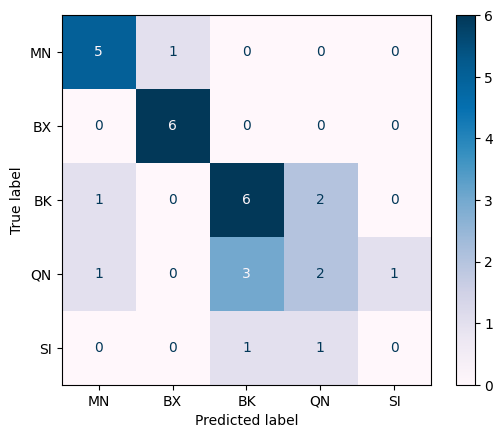

# point-cloud-classification

# Info

This project aims to classify New York City Boroughs with point cloud data using a Graph Neural Network. The model is trained on segments of the five boroughs. The idea is that the network picks up on each borough's distinct features (building size, density, distribution). The PointNet++ Graph Convolutional Neural Network obtains a testing accuracy of <>%, while the Point Cloud Transformer achieves a testing accuracy of <>%

# Setup

## Requirements

1. Download `pytorch`
2. Download `pytorch-geometric` with additional dependencies
3. Install other requirements

## How to Run
Run `point_transformer_classification.ipynb` to train and test the Point Cloud Transformer.

Run `graph_convolutional_network.ipynb` to train and test the PointNet++ Graph Convolutional Network.

Optionally, you can redownload the dataset by running `download_data.py`, which installs, unzips, and formats the dataset provided from the official [NYC 3D model dataset](https://www.nyc.gov/site/planning/data-maps/open-data/dwn-nyc-3d-model-download.page).

# Methodology

I found the official [NYC 3D model dataset](https://www.nyc.gov/site/planning/data-maps/open-data/dwn-nyc-3d-model-download.page) divided into 59 Community Districts. These were in a proprietary `.3dm` file format. However, I found a python library `rhino3dm` which allowed me to process the file format and obtain the vertices. The vertices obtained are plotted below.

As the boroughs were split into Community Districts (CDs), some chunks were used as training data while others were used as testing data, split equally.

For each `.3dm` file, the vertices were extracted. These vertices represented the points of all of the buildings in a CD, and were used as the point cloud data for the network.

Afterwards, each point cloud file was imported into PyTorch to create a dataset. The point clouds can either be fed in raw or sampled in order to run the model faster.

Finally, the dataset is fed into either a graph convolutional network or a point cloud transformer in order to train and test it. Pytorch Geometric is a library to write and train Graph Neural Networks (GNNs).

## Challenges
The dataset initally required around 50GB of free space in order to download all of the dataset. However, I now download and process one file at a time, thus greatly reducing the storage need.

# Images
## Aerial Point Cloud Plot of Manhattan 

## Top-Down Point Cloud Plot of Manhattan

## Point Cloud Transformer
###  Accuracy

### Confusion Matrix

# References
